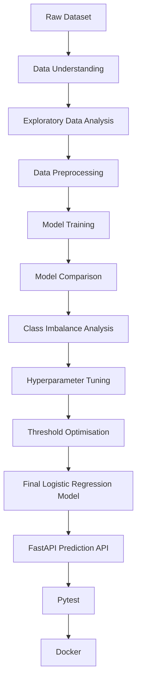

# Customer Churn Intelligence Platform

A machine learning-powered customer churn prediction system that predicts the probability of customer churn and classifies customers into risk levels.

The project combines a trained Logistic Regression model with a reusable preprocessing pipeline and exposes the model through a FastAPI REST API. The API includes input validation, health monitoring, automated tests, and Docker-based deployment.

## Table of Contents

- [Features](#features)
- [Machine Learning](#machine-learning)
- [API](#api)
- [Project Structure](#project-structure)
- [Running Locally](#running-locally)
- [Running Tests](#running-tests)
- [Docker](#docker)
- [Tech Stack](#tech-stack)
- [Project Workflow](#project-workflow)
- [Business Objective](#business-objective)
- [Future Improvements](#future-improvements)
- [Author](#author)

## Features

- Customer churn prediction using Machine Learning
- Churn probability estimation
- Custom decision threshold of 0.35
- High/Low customer risk classification
- Input validation using Pydantic
- FastAPI REST API
- Interactive Swagger API documentation
- Health check endpoint
- Centralised prediction error handling
- Automated API tests using Pytest
- Dockerised deployment

## Machine Learning

The project uses the **Telco Customer Churn dataset** to predict whether a customer is likely to churn.

### Data Preprocessing

The preprocessing pipeline includes:

- Numerical feature imputation using the median
- Numerical feature standardisation using `StandardScaler`
- Categorical feature imputation using the most frequent value
- Categorical feature encoding using `OneHotEncoder`
- Stratified train-test split

The preprocessing pipeline is saved as `preprocessor.pkl` and reused during API inference so that new customer data receives the same transformations used during model training.

### Model Selection

The following classification models were evaluated:

- Logistic Regression
- Decision Tree
- Random Forest
- XGBoost

Stratified 5-fold cross-validation was used for model comparison using ROC-AUC.

| Model | Cross-Validation ROC-AUC |
|---|---:|
| Logistic Regression | 0.8583 |
| XGBoost | 0.8544 |
| Random Forest | 0.8449 |
| Decision Tree | 0.6664 |

**Logistic Regression** achieved the best cross-validation ROC-AUC and was selected as the final model.

The final Logistic Regression model achieved **84.78% ROC-AUC** on the holdout test set.

### Decision Threshold Optimisation

The default classification threshold of `0.50` was changed to **0.35** after evaluating out-of-fold predictions.

The lower threshold prioritises identifying customers who are likely to churn, which is useful when the business objective is customer retention.

At a threshold of `0.35`:

| Metric | Score |
|---|---:|
| Accuracy | 77.79% |
| Precision | 56.39% |
| Recall | 71.93% |
| F1-score | 63.22% |
| ROC-AUC | 84.78% |

The threshold increases recall compared with the default 0.50 threshold while maintaining the same ROC-AUC.

## API

The application is built using **FastAPI** and provides three main endpoints.

### Endpoints

| Method | Endpoint | Description |
|---|---|---|
| GET | `/` | Confirms that the API is running |
| GET | `/health` | Checks API and ML model health |
| POST | `/predict` | Predicts customer churn probability and risk |

### Prediction Response

A successful prediction returns:

```json
{
  "prediction": 1,
  "churn_probability": 0.7989,
  "risk_level": "High",
  "message": "Customer is likely to churn."
}
```

Where:

- `prediction = 1` → customer is predicted to churn
- `prediction = 0` → customer is predicted not to churn
- `churn_probability` → predicted probability of churn
- `risk_level` → customer risk classification
- `message` → human-readable prediction result

### Input Validation

Incoming customer data is validated using Pydantic.

Invalid categorical values or invalid numerical ranges are rejected with:

```
HTTP 422 Unprocessable Entity
```

### API Documentation

After starting the application, interactive Swagger documentation is available at:

```
http://127.0.0.1:8001/docs
```

## Project Structure

```
customer-churn-intelligence-platform/
│
├── 01_Data_Understanding.ipynb
├── 02_EDA.ipynb
├── 03_Data_Preprocessing.ipynb
├── 04_Baseline_Model_Training.ipynb
├── 05_Cross_Validation_and_Model_Comparison.ipynb
├── 06_Handling_Class_Imbalance.ipynb
├── 07_Hyperparameter_Tuning.ipynb
├── 08_Business_Insights_and_Recommendations.ipynb
├── 09_Threshold_Optimization.ipynb
│
├── backend/
│   ├── __init__.py
│   ├── config.py
│   ├── exceptions.py
│   ├── main.py
│   ├── prediction_service.py
│   └── schemas.py
│
├── tests/
│   └── test_api.py
│
├── customer.csv
├── final_logistic_regression_model.pkl
├── preprocessor.pkl
├── baseline_model_results.csv
├── baseline_vs_tuned_logistic_regression.csv
├── class_imbalance_results.csv
├── cross_validation_results.csv
│
├── Dockerfile
├── requirements.txt
├── pytest.ini
├── .gitignore
└── README.md
```

## Running Locally

### 1. Clone the repository

```bash
git clone https://github.com/SayeedullahAlom/customer-churn-intelligence-platform.git
cd customer-churn-intelligence-platform
```

### 2. Create and activate the environment

```bash
conda create -n backend python=3.12
conda activate backend
```

### 3. Install dependencies

```bash
pip install -r requirements.txt
```

### 4. Start the API

```bash
python -m uvicorn backend.main:app --reload --port 8001
```

The API will be available at:

```
http://127.0.0.1:8001
```

Swagger documentation:

```
http://127.0.0.1:8001/docs
```

## Running Tests

The API is tested using Pytest.

Run:

```bash
pytest -q
```

Expected result:

```
5 passed
```

The tests cover:

- API root endpoint
- Health check endpoint
- High-risk churn prediction
- Low-risk churn prediction
- Invalid input validation

## Docker

The API can be run inside a Docker container.

### Build the Docker image

```bash
docker build -t customer-churn-api .
```

### Run the container

```bash
docker run -d --name customer-churn-container -p 8001:8001 customer-churn-api
```

The API will then be available at:

```
http://127.0.0.1:8001
```

Swagger:

```
http://127.0.0.1:8001/docs
```

### Docker Health Check

The `/health` endpoint confirms that the model and preprocessing pipeline are loaded correctly.

Example:

```json
{
  "status": "healthy",
  "model_loaded": true,
  "preprocessor_loaded": true,
  "churn_threshold": 0.35
}
```

## Tech Stack

**Machine Learning**
- Python
- Pandas
- NumPy
- Scikit-learn
- XGBoost
- Joblib

**Backend**
- FastAPI
- Pydantic
- Uvicorn

**Testing**
- Pytest
- FastAPI TestClient

**Deployment**
- Docker

**Development**
- Jupyter Notebook
- Git
- GitHub

## Project Workflow



## Business Objective

Customer churn prediction can help businesses identify customers who are at higher risk of leaving.

The model's probability output can be used to prioritise retention efforts such as:

- Targeted retention campaigns
- Personalised offers
- Customer support interventions
- Contract or pricing recommendations

The decision threshold is intentionally lowered to 0.35 to favour recall because missing a potential churn customer can be more costly than contacting some customers who ultimately would not churn.

## Future Improvements

Potential improvements include:

- Add a frontend dashboard for customer risk analysis
- Add batch prediction support
- Add database integration
- Add authentication and authorisation
- Add model monitoring
- Add CI/CD using GitHub Actions
- Deploy the API to a cloud platform

## Author

**Sayeedullah Alom**

BTech CSE — NIT Silchar

